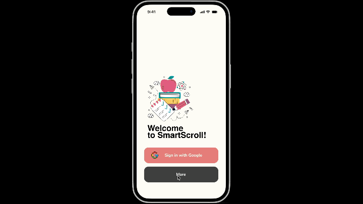

# SmartScroll
SmartScroll is an AI-Driven Interactive Learning Platform is designed to provide personalized
learning experiences for students by automatically generating quizzes,
flashcards, and summaries from user-uploaded study materials.



** React Native Installation**

Clone the repository -> Navigate to react-native-app folder:

```bash
cd react-native-app
```

Install the project dependencies using npm:

```bash
npm install
```

**Running the Project**

```bash
npm start
```